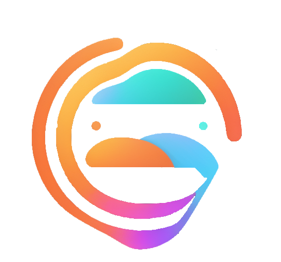

<h1>{Code} Path</h1>

<h1>Code Path way to success!</h1>
    <h3>Code Path is an innovative and user-friendly website that empowers aspiring developers and tech enthusiasts to sharpen their coding skills and excel in technical interviews. Our platform offers a comprehensive collection of interview questions from various programming languages, data structures, algorithms, and popular tech domains.</h3>
    <h2>About Us:</h2>
    <h4>At Code Path, our mission is to equip developers with the tools and resources they need to excel in their coding journey. Our team comprises passionate individuals dedicated to fostering a thriving developer community and helping aspiring coders achieve their professional goals.</h4>
	<h2>Developers</h2>

-  [AshiqurRahaman](https://github.com/AshiqurRahaman02)

<h2>Tech Stacks</h2>

<h2>Key Features:</h2>
   		<h3>SignIn and SignUp:</h3>
   		

   			Code Path offers a seamless and secure user registration process. New
   			users can easily create an account with their email address and
   			password. Existing users can sign in with their credentials to access
   			their personalized learning dashboard.
   		

   		<h3>Extensive Question Bank:</h3>
   		

   			Access a vast repository of interview questions ranging from beginner
   			to advanced levels, carefully curated to cover a wide spectrum of
   			programming concepts and problem-solving techniques.
   		

   		<h3>Progress Tracking:</h3>
   		

   			Signed-in users can track their progress, view completed challenges,
   			and identify areas for improvement on their learning dashboard. This
   			feature empowers users to continuously monitor their growth and set
   			personal coding goals.
   		

       <h2>How it Works:</h2>
   		<h3>SignIn and SignUp:</h3>
   		

   			New users can easily create an account by providing their email address
   			and a secure password. Alternatively, they can use their social media
   			accounts to sign up. Existing users can log in with their registered
   			email address and password or choose to log in using their social media
   			accounts.
   		

   		<h3>Start Practice:</h3>
   		

   			Choose from a variety of coding domains and topics to practice. Access
   			an extensive collection of interview questions tailored to your skill
   			level. Enter your answer in our user-friendly textarea. Submit your
   			answer.
   		

   		<h3>User Dashboard:</h3>
   		

   			Track your progress, review past challenges, and focus on areas that
   			need improvement.
   		

<h2>Why Choose Code Path?</h2>
           <h3>Expertly Curated Content:</h3>
           
Our team of experienced creators meticulously selects interview questions to ensure relevance and align them with industry standards.

           <h3>Hands-on Learning:</h3>
           
Practice coding in real-world interview questions, giving you a competitive edge during interviews.

           <h3>Continuous Improvement:</h3>
           
We are committed to providing regular updates, adding new questions, and incorporating user feedback to enhance the learning experience continually.

<h2>Target Audience:</h2>
           
Code Path caters to developers of all levels, from coding enthusiasts looking to enhance their skills to job seekers preparing for technical interviews.

<h2>Contributing:</h2>
           
We encourage contributions from the open-source community to help us expand our question bank and improve the overall learning experience.

<h2>Usage:</h2>
           
Code Path aims to be a one-stop solution for interview question practice. Users can leverage our platform to sharpen their coding skills and gain confidence in technical interviews.

<h2>Contact Information:</h2>
           
For any inquiries, support, or suggestions, please feel free to reach out to us at ashiqur999999@gmail.com .

           Join Code Path today and embark on a rewarding path to interview success! Happy coding!
